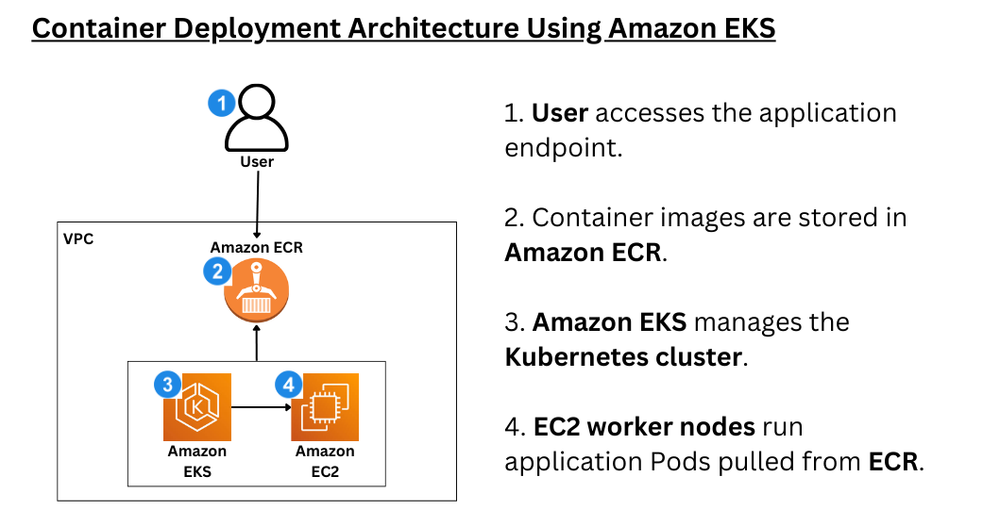

# Kubernetes Deployment on Amazon EKS

## 📖 Introduction

This project demonstrates how to deploy a containerized backend application on Amazon Elastic Kubernetes Service (EKS) using a cloud-native approach.

The goal is to standardize application deployment by replacing manual local execution with a scalable, repeatable, and production-like Kubernetes-based deployment model.

This project simulates how a DevOps engineer introduces Kubernetes into an organization, starting from a single service and building a foundation for future scalability.

---

## 🚀 Features

* Containerized application using Docker
* Image storage with Amazon ECR
* Kubernetes cluster managed by Amazon EKS
* Application deployment using Kubernetes Deployment
* External access via NodePort Service
* Health check endpoints for monitoring
* End-to-end cloud-native deployment workflow

---

## 🏗️ Architecture

<p align="center">
  
</p>

The architecture follows a standard Kubernetes deployment model on AWS:

1. Users access the application endpoint
2. Docker images are stored in Amazon ECR
3. Amazon EKS manages the Kubernetes cluster
4. EC2 worker nodes run Pods pulled from ECR
5. Kubernetes Services route traffic to the application

---

## 🧰 Tech Stack

* Docker
* Kubernetes
* Amazon EKS
* Amazon ECR
* AWS EC2
* AWS VPC
* AWS IAM
* kubectl

---

## 📂 Project Structure

```bash
.
├── app/
│   ├── src/
│   ├── public/
│   ├── Dockerfile
│   ├── package.json
│   └── package-lock.json
├── k8s/
│   ├── deployment.yaml
│   └── service.yaml
├── assets/
│   └── architecture.png
└── README.md
```

---

## ⚙️ Prerequisites

Make sure the following tools are installed:

* AWS CLI
* kubectl
* Docker
* eksctl (optional but recommended)

Also ensure:

* AWS account configured
* IAM permissions for EKS, EC2, ECR, VPC

---

## 🛠️ Deployment Steps

### 1. Build Docker Image

```bash
docker build -t my-app .
```

---

### 2. Push Image to Amazon ECR

```bash
aws ecr get-login-password --region <region> | docker login --username AWS --password-stdin <account-id>.dkr.ecr.<region>.amazonaws.com

docker tag my-app:latest <account-id>.dkr.ecr.<region>.amazonaws.com/my-app:latest

docker push <account-id>.dkr.ecr.<region>.amazonaws.com/my-app:latest
```

---

### 3. Create EKS Cluster

```bash
eksctl create cluster --name my-cluster
```

---

### 4. Deploy Application to Kubernetes

```bash
kubectl apply -f k8s/deployment.yaml
kubectl apply -f k8s/service.yaml
```

---

### 5. Verify Deployment

```bash
kubectl get pods
kubectl get services
```

---

## 🌐 Application Access

Once deployed, access the application via:

```
http://<EC2-Public-IP>:<NodePort>
```

---

## 📊 Kubernetes Concepts Covered

* Pods
* Deployments
* Services
* NodePort networking
* Container registry integration
* Cluster networking
* Application lifecycle in Kubernetes

---

## ✅ Final Outcome

* Application successfully deployed on Amazon EKS
* Traffic routed through Kubernetes Service
* Pods managed automatically by Kubernetes Deployment
* Hands-on understanding of cloud-native application deployment

---

## 📈 Future Improvements

* Add Ingress with AWS ALB
* Enable HTTPS
* Implement Horizontal Pod Autoscaler (HPA)
* Add CI/CD pipeline (GitHub Actions)
* Introduce Helm charts
* Add monitoring (CloudWatch / Prometheus)

---

## 🧠 Lessons Learned

* How to containerize applications using Docker
* How Kubernetes pulls images from ECR
* How Deployments manage Pods
* How Services route traffic in Kubernetes
* How AWS integrates with Kubernetes networking
